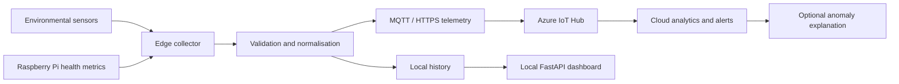

# Cloud-Connected Hardware & AI Monitoring

> A Raspberry Pi–focused monitoring project that is being developed toward edge telemetry, device health checks, and practical cloud-connected operations.

<p align="center">
  <a href="https://github.com/Vahid-Rahmani/Cloud-Connected-Hardware-IoT-Monitor"></a>
  <a href="https://www.raspberrypi.com/"></a>
  <a href="https://azure.microsoft.com/products/iot-hub"></a>
</p>

## Project direction

This repository is the dedicated Raspberry Pi / hardware monitoring track. Its long-term goal is to collect environmental and system telemetry at the edge, validate it locally, send selected data to a cloud service, and present useful operational context through a lightweight dashboard.

The current codebase is a small FastAPI monitoring foundation shared with the Windows infrastructure lab. The Raspberry Pi sensor, MQTT/HTTPS telemetry, Azure IoT Hub, SQLite history, and anomaly-detection layers are clearly marked as roadmap work until their implementation is added to the repository.

## Target architecture



## Current implementation

- FastAPI application with a `/api/devices` endpoint.
- Browser dashboard served by `app.py`.
- Collector structure for discovery, reachability, and host health metrics.
- Timeout-aware concurrent collection.
- Explicit roadmap for Raspberry Pi sensor and cloud telemetry work.

## Planned hardware and telemetry

| Platform / component | Intended role | Status |
| --- | --- | --- |
| Raspberry Pi 4/5 | Linux edge collector and local dashboard | Planned |
| ESP32 | Low-power sensor node | Planned |
| DHT22 / BME280 / DS18B20 / SHT31 | Environmental measurements | Planned |
| MQTT or HTTPS | Telemetry transport | Planned |
| Azure IoT Hub | Device-to-cloud ingestion | Planned |
| SQLite | Local history and offline resilience | Planned |

## Local foundation setup

The current foundation runs on Python and exposes a local FastAPI dashboard:

```bash
git clone https://github.com/Vahid-Rahmani/Cloud-Connected-Hardware-IoT-Monitor.git
cd Cloud-Connected-Hardware-IoT-Monitor
python -m venv .venv
# Windows PowerShell
.\.venv\Scripts\Activate.ps1
pip install -r requirements.txt
python -m uvicorn app:app --reload
```

Open <http://127.0.0.1:8000>. Before using the collector in a lab, review the controller address and the PowerShell credential-file requirement in `collector.py`.

## Security model for the next stage

- Keep device credentials and cloud keys outside Git.
- Use per-device identity and least-privilege access in Azure IoT Hub.
- Validate and bound telemetry before forwarding it.
- Keep local monitoring useful when the cloud connection is unavailable.
- Treat AI explanations as optional context; measurements and alert rules remain the source of truth.

## Roadmap

- [x] Establish a dedicated hardware-monitoring repository
- [x] Add the FastAPI monitoring foundation
- [ ] Add Raspberry Pi OS collector for CPU, memory, disk, temperature, uptime and interfaces
- [ ] Add sensor adapters and a documented wiring guide
- [ ] Add local SQLite history and offline buffering
- [ ] Add secure Azure IoT Hub telemetry
- [ ] Add dashboard history, thresholds and alert delivery
- [ ] Add lightweight anomaly scoring with evidence
- [ ] Add optional AI incident explanations

## Related projects

- [Automated Hybrid Network & Monitoring Dashboard](https://github.com/Vahid-Rahmani/Automated-Hybrid-Network-Monitoring-Dashboard) — Windows/Active Directory monitoring track.
- [Azure AI Specialist](https://github.com/Vahid-Rahmani/Azure-AI-Specialist-Project-Plan) — Azure knowledge and evaluation foundation.
- [Vahid Rahmani portfolio](https://vahid-portfolio-three.vercel.app/)

## License

Project licensing and hardware documentation will be defined as the implementation is stabilised.
